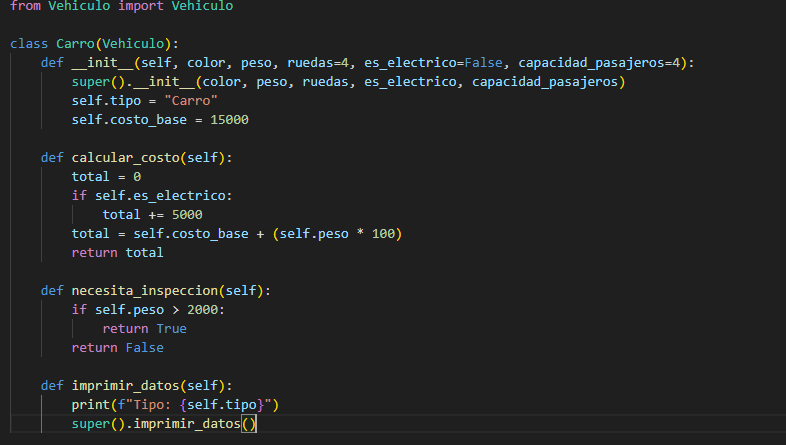
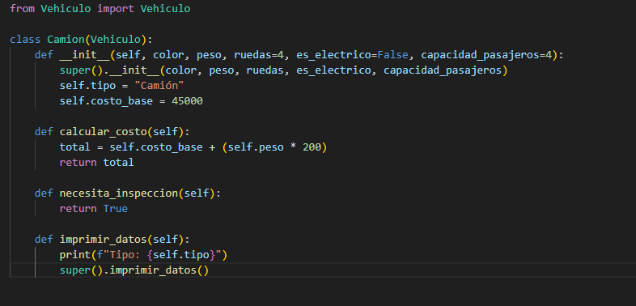
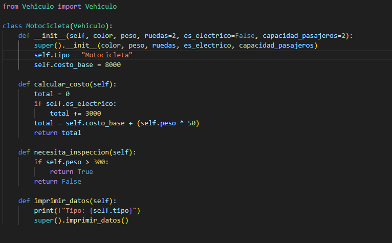
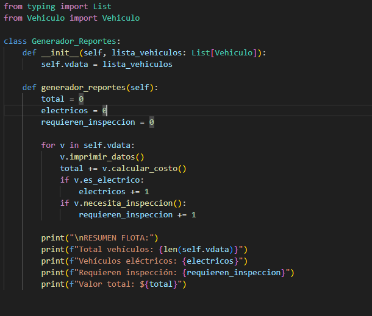

# Tarea#2

# Diego Cerdas Delgado C21988

# Enunciado
## Para la entrega de este trabajo se solicitó Refactorizar un códifo que simulaba una flotilla de distintos tipos de vehículos, esto con la intención de aplicar el uso de buenas prácticas de programación y principios de diseño.

# Análisis

## En el codigo facilitado existía una sola interfaz general llamada vehículo, en busca de poner en práctica el principio SOLID de Interface Segregation Principle, donde principalmente se busca la creación de múltiples interfáces específicas que implementen solo lo que necesitan. Por lo tanto la clase vehículo se transformó en una clase abstracta que dio origen a las clases Camión. 





## Esta implementación también permite poder expandir y escalar el código sin la necesidad de cambiar ninguna de las implementaciones ya establecidas, siendo esto un claro ejemplo del principio de SOLID de Open Closed. Podríamos crear una nueva interfaz de vehículo, por ejemplo carro volador pudiendo implementar los requerimientos necesarios para este nuevo vehículo sin necesidad de modificar el código existente.

## Finalmente se decidió dividir la carga de trabajo de flota para que esta clase únicamente se encargara de del registro de los automóviles, por lo que se decidió implementar una clase llamada Generador de reportes que manejara la lógica de la creación de estos mismos. Esto en base la principio Solid de Responsabilidad única donde cada componente del código se encarga de una sola tarea dividiendo la carga.



# Ejemplo de prueba

```bash
python3 prove.py
```
